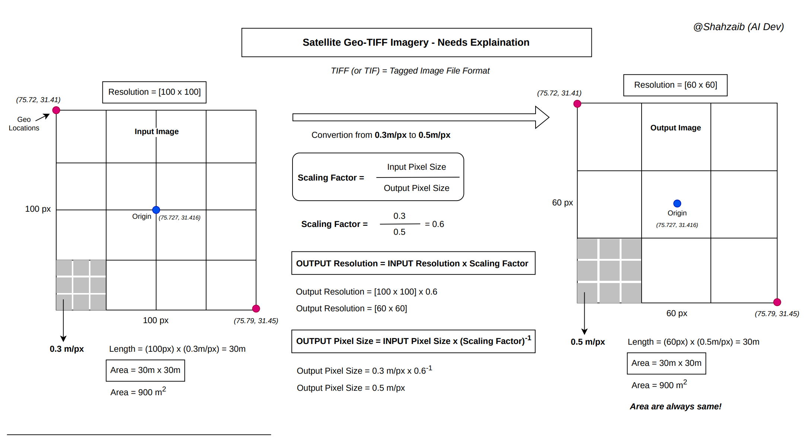

# Resize TIFF Images with Pixel Size

## **Introduction**
TIFFPixelResizer is a versatile image processing tool designed to efficiently resize TIFF images to specific pixel dimensions. This repository provides a user-friendly command-line interface and library that allows you to adjust the dimensions of TIFF images while preserving their quality and aspect ratio.



## **Resolution**

`Resolution` refers to the level of detail in an `image` or video, which is determined by the number of `pixels` in the `[width x height]` dimensions.

**Unit**: `Pixels (px)`

## **Pixel Size**

`Pixel Size` indicates the resolution of an image, representing how many meters are covered by each pixel in the image.

**Unit**: `Meter per pixel (m/px) or (mpp)`

## **Image Density**

`Image Density` refers to the amount of information contained within a specific area or volume of an image. This can be expressed using either `Pixels per inch (PPI)` or `Dots per inch (DPI)` measurements.

## **Scaling Factor**

A `Scaling Factor` is a `constant` used to resize images by multiplying or dividing their size or dimensions.

#

## **Requirements**

- Conda (Package and environment management system)
- Python = 3.7.7 (Versatile high-level programming language)
- OpenCV (Open Computer Vision Library)
- GDAL (Geospatial Data Abstraction Library)

## Create Conda Envionment
```sh
conda env create -f environment.yml
```
### Activate the Envionment
```sh
conda activate gdal
```

## Usage
```sh
python setup.py [inputImg] [pixelSize]
```
### Example
```
python setup.py img.tif 0.5
```
- `Output (converted) image will be saved in the same input path.`

## Snippets
### Extracting Image Pixel Size from Input Image
```python
dst = gdal.Open(input_img)
dstt = dst.GetGeoTransform()
dsmppx = dstt[1] * 100000
input_mppx = round(dsmppx,2)
```

### Updating New Pixel Size (meter per pixel)

```python
new_x_mpp = x_mpp * (1/scaling_factor)
new_y_mpp = y_mpp * (1/scaling_factor)
geo_transform = list(geo_transform)
geo_transform[1] = new_x_mpp
geo_transform[5] = new_y_mpp
```

- `Scaling factor calculation is shown in the `[workflow diagram](./imgs/im1.png) 

### Set geolocation back to a resized tif image
```python
ds = gdal.Open(output_img, gdal.GA_Update)
ds.SetGeoTransform(tuple(geo_transform))
ds.SetProjection(projection)
ds = None
```


## License

This project is licensed under the [MIT License](LICENSE). \
Author @ [Shahzaib](./) (AI Dev)

---
Feel free to contribute to this documentation by creating pull requests or raising issues.